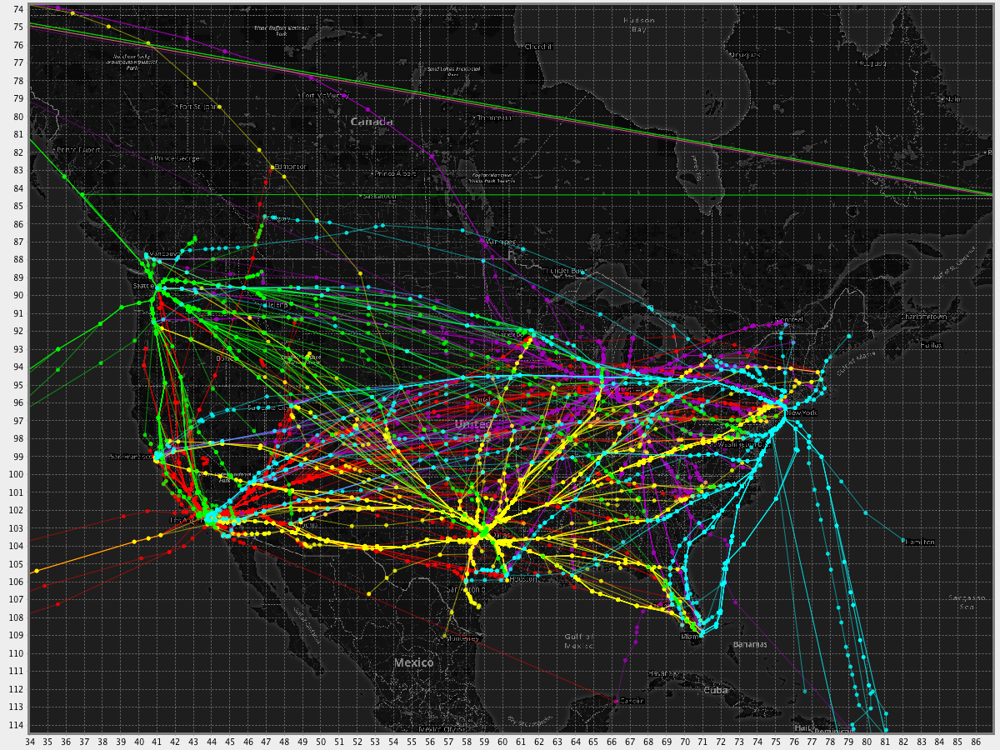
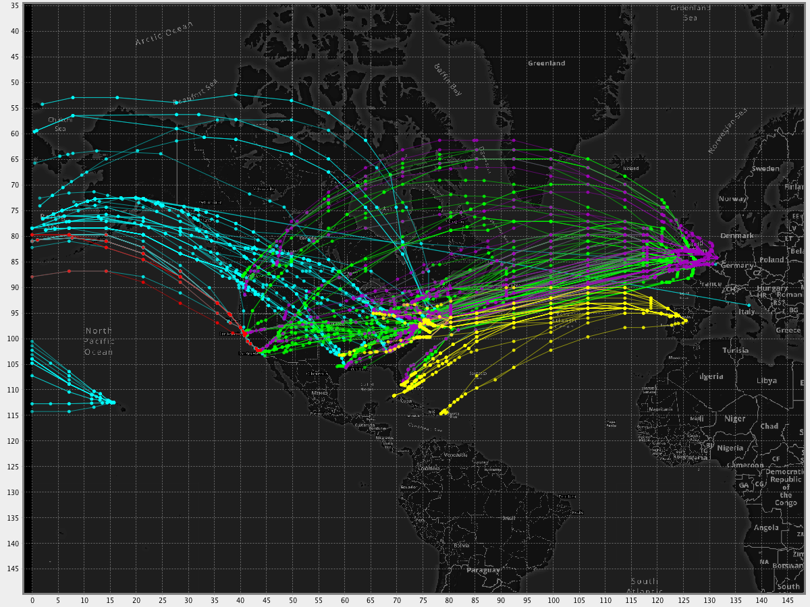
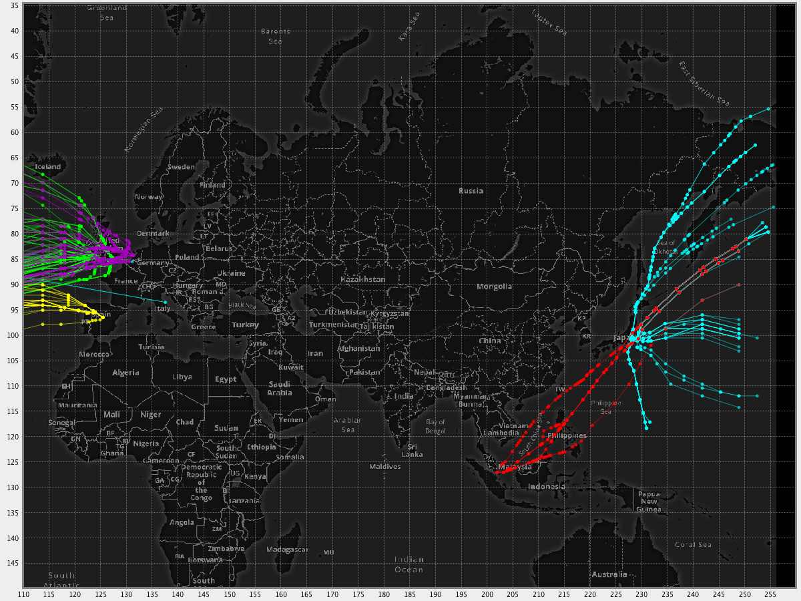

# Boogie Routes

## Module overview

This module provides a configurable API for converting input route strings into 2D paths through navigation infrastructure.

## Quick start

The primary entrypoint into the codebase is `FluentRouteExpander.java`. It provides an easy-to-use out-of-the-box route expander implementation while allowing 
client's to quickly customize its features later.

Assuming you have collections of `Procedure`, `Airway`, `Fix`, and `Airport` implementations on hand (e.g. from `boogie-arinc`):

```java
Collection<Procedure> procedures...
Collection<Airway> airways...
Collection<Fix> fixes...
Collection<Airport> airports...

String myRouteString....

FluentRouteExpander routeExpander = FluentRouteExpander.inMemoryBuilder(airports, procedures, airways, fixes).build();

// expansion through the common portion of the SID/STAR (if present)
Optional<ExpandedRoute> expandedRoute = routeExpander.apply(myRouteString);

// expansion through the appropriate runway transitions of the SID/STAR given the arr/dep runway
Optional<ExpandedRoute> expandedRoute = routeExpander.apply(myRouteString, myDepartureRunway, myArrivalRunway);

// expansion through the appropriate runway transitions and then onto the conventional approach serving the arrival runway
Optional<ExpandedRoute> expandedRoute = routeExpander.apply(myRouteString, myDepartureRunway, myArrivalRunway, CONV);

// expansion through the appropriate runway transitions and then onto the RNP approach (if one exists) or else the RNAV (if one exists) or else the CONV (if one exists)
Optional<ExpandedRoute> expandedRoute = routeExpander.apply(myRouteString, myDepartureRunway, myArrivalRunway, RNP, RNAV, CONV);
```

## Design

Boogie has a highly modular design, allowing clients to swap out significant portions of the logic backing the expansion process with their own should they need that level of 
customization.

The four key abstractions that Boogie allows clients to override (and provides a few implementations of internally) tell Boogie how to:

1. `RouteTokenizer` - break apart the route into `RouteTokens` which should be processed independently
2. `RouteTokenResolver` - resolve individual `RouteTokens` to known navigation infrastructure `ResolvedTokens`
3. `SectionInferrer` - infer additional infrastructure beyond what appears in the route based on additional context
4. `RouteChooser` - choose an unambiguous path through all `ResolvedTokens`

Boogie ships with support for ICAO and FAA formatted route strings, token resolvers for all the commonly filed infrastructure element types (see [below](#what-are-route-strings?)), and a graph-based route chooser implementation to handle ambiguous elements in filings.

Clients should refer to the defined interfaces in the code to see what all are supported out-of-the-box.

## What are route strings?

What is a route string? Generally speaking it's a formatted string giving an indication of the path a flight intends to take to get from its origin to its destination. This route may be 
updated several times over the course of the flight as the aircraft makes progress along its filed path or in response to changes in the current state of the NAS (e.g. severe weather, 
space launches, high demand, etc.). Typically the last filed pre-departure route (LFPD route for short) is the finalized intent of the aircraft given conditions just prior to departure and 
will contain some collection of airways, fixes, a SID, and a STAR as well as the arrival and departure airport. Over the course of the flight the aircraft will file amendments to this route 
in response to changing conditions.

Lets break down some example routes:

1. ```KBDL.CSTL6.SHERL.J121.BRIGS.JIIMS2.KPHL/0054```
2. ```KDFW.LOWGN7.ROLLS.J20.SEA.J502.YZT.J523.YZP.TR18.KATCH..HMPTN..GRIZZ..CJAYY..5800N/16000W..OGGOE..NANDY..NATES..NIKLL..NYMPH..NUZAN..NRKEY..NIPPI.R220.NANAC.Y810.KETAR.Y811.MELON..RJAA/1252```

Routes can be of varying lengths and may continue internationally - regardless all routes can be broken down generally into 6 types of elements:

<table class="table table-bordered">
  <thead>
    <tr>
      <th class="text-left">Name</th>
      <th class="text-left">Example</th>
      <th class="text-left">Location</th>
    </tr>
  </thead>
  <tbody>
    <tr><td>Airport</td><td>KBDL</td><td>Typically show up at the start and end of the route string, however it's not uncommon to file the reference navaid for the airport instead (in this case BDL)</td></tr>
    <tr><td>Fix (Waypoint/Navaid)</td><td>SHERL</td><td>Both waypoints and navaids show up in 3 primary cases in the route, two (as tailored waypoints, as entry/exit fixes) will be covered in other sections. The final is as a direct-to, this is denoted as GRIZZ..CJAYY which simply means once you arrive at GRIZZ proceed directly to CJAYY.</td></tr>
    <tr><td>Procedure</td><td>CSTL6</td><td>Procedures are typically referenced as trios of the form APT.PROC.FIX (SID) or FIX.PROC.APT (STAR) though they may be filed as FIX.PROC.FIX where one of the fixes refers the airport reference navaid. In the standard case the fix specifies the entry/exit point at which the aircraft intends to join or leave the procedure and typically ends up specifying the enroute transition the flight will take. Note the SID/STAR and rest of the route give no information about the approach procedure and arrival runway that will be used.</td></tr>
    <tr><td>Airway</td><td>J121</td><td>The first is as an entry/exit waypoint to an airway or procedure in which case they will be filed as FIX.AWY.FIX (i.e. SHERL.J121.BRIGS indicates the aircraft will join airway J121 at fix SHERL and exit it at BRIGS).</td></tr>
    <tr><td>Tailored Waypoint/Navaid</td><td>HTO354018</td><td>Tailored waypoint are generally filed with respect to a VOR but may be referring to an NDB or waypoint instead. In any case the first 3-5 characters indicate the infrastructure element the following 6 numbers are to be processed with respect to. Of the following 6 numbers the first three refer a bearing from the referenced waypoint/navaid and the following 3 give a distance in nm. That is to say the tailored waypoint HTO354018 is the point 18 miles away from navaid HTO at bearing 354 (to convert this to true course add the station declination).</td></tr>
    <tr><td>Lat/Lon</td><td>5800N/16000W</td><td>In particular for oceanic routes the filed route may contain simple lat/lon coordinates in the format DDMM{N,S}/DDDMM{E,W}. That is to say 5800N/16000W refers to coordinates (58.0,-160.0) in decimal degrees.</td></tr>
  </tbody>
</table>

In both the routes above there is a section after the final airport containing a / and 4 numbers. This can be one of two things, either an estimated enroute time (typically in pre-departure 
flightplans) or the estimated time of arrival (typically in post-departure flightplans). In both the above routes those are estimated enroute times, for the KBDL-KPHL flight the flight is 
estimated to take 54 minutes, while the KDFW-RJAA flight is estimated at 12 hours and 52 minutes. If the second was an ETA it would mean the flight was expected to arrive at 12:52 PM. Note 
there is no indication of the day of arrival.

There is also a collection of wildcard characters that can appear in flightplans next to the elements outlined above. There are a reasonable number of them but the vast majority are 
extremely uncommon to see filed, the two you're most likely to come across are (+ and *). * indicates that an ADR/ADAR (adapted arrival/departure route) has been suppressed in the 
flightplan, while + can be either military in nature in which case it means to expect multiple flyovers of the associated fix or it may occur in pairs and indicate special route printing. 

<div class="img-with-text">
<p>Domestic routes by arrival airport (<span style="color: red;">KLAX</span>, <span style="color: lime;">KSEA</span>, <span style="color: purple;">KORD</span>,
 <span style="color: cyan;">KJFK</span>, <span style="color: gold;">KDFW</span>):</p>
</div>
<br />


<br />
<div class="img-with-text">
<p>International expansions  (<span style="color: red;">WSSS</span>, <span style="color: lime;">EGLL</span>, <span style="color: purple;">EHAM</span>,
 <span style="color: cyan;">RJAA</span>, <span style="color: gold;">LEMD</span>):</p>
</div>



