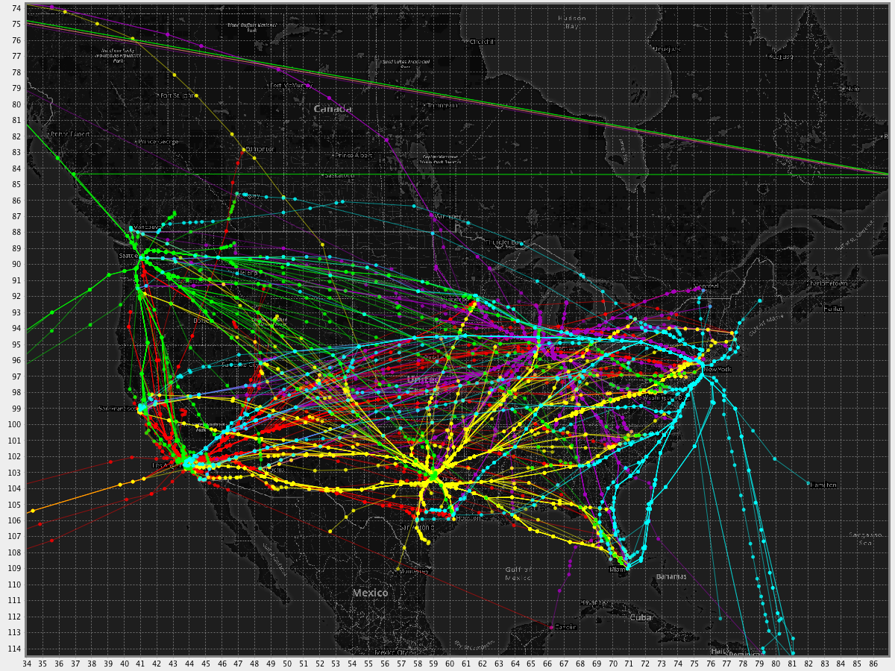
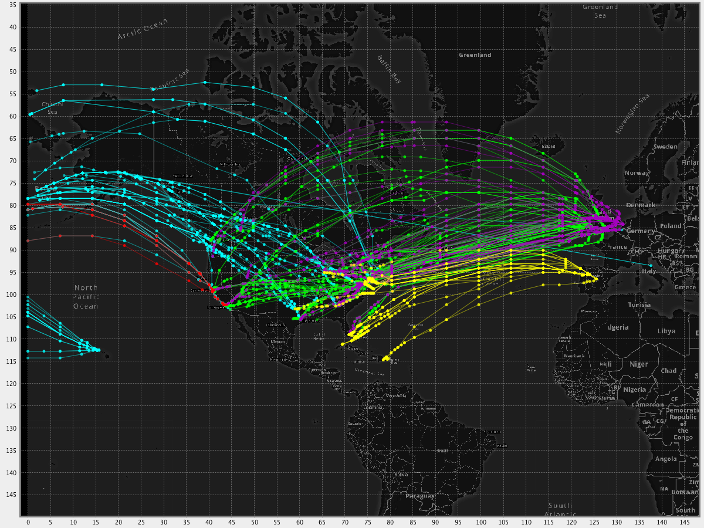
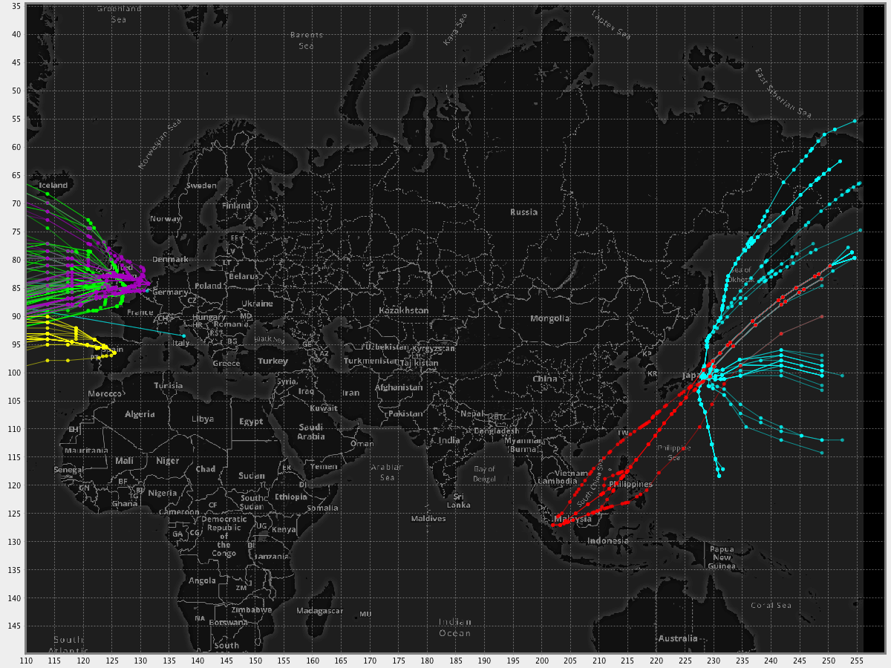

# Boogie Routes

## Module overview

This module provides a configurable API for converting input route strings into 2D paths through navigation infrastructure.

## Quick start

The primary entrypoint into the codebase is `FluentRouteExpander.java`. It provides an easy-to-use out-of-the-box route expander implementation while allowing 
client's to quickly customize its features later.

Assuming you have collections of `Procedure`, `Airway`, `Fix`, and `Airport` implementations on hand (e.g. from `boogie-arinc`):

```java
Collection<Procedure> procedures...
Collection<Airway> airways...
Collection<Fix> fixes...
Collection<Airport> airports...

String myRouteString....

FluentRouteExpander routeExpander = FluentRouteExpander.inMemoryBuilder(airports, procedures, airways, fixes).build();

// expansion through the common portion of the SID/STAR (if present)
Optional<ExpandedRoute> expandedRoute = routeExpander.apply(myRouteString);

// expansion through the appropriate runway transitions of the SID/STAR given the arr/dep runway
Optional<ExpandedRoute> expandedRoute = routeExpander.apply(myRouteString, myDepartureRunway, myArrivalRunway);

// expansion through the appropriate runway transitions and then onto the conventional approach serving the arrival runway
Optional<ExpandedRoute> expandedRoute = routeExpander.apply(myRouteString, myDepartureRunway, myArrivalRunway, CONV);

// expansion through the appropriate runway transitions and then onto the RNP approach (if one exists) or else the RNAV (if one exists) or else the CONV (if one exists)
Optional<ExpandedRoute> expandedRoute = routeExpander.apply(myRouteString, myDepartureRunway, myArrivalRunway, RNP, RNAV, CONV);
```

## Benchmarking

The JMH benchmark reuses two navigation fixtures from `FluentRouteExpanderTest`:

| Case | Filed route | Expanded legs |
| --- | --- | --- |
| `MULTI_AIRWAY` | `SAP.UG521.CZM.UB881.CUN.UM219.MYDIA` | 14 |
| `STAR_APPROACH` | `RSW.COSTR3.KMCO`, arrival runway `RW17R`, equipage `CONV` | 18 |

These cover three connected airways with ambiguous fix/procedure identifiers, and a STAR joining an approach.
The expander, lookup indexes, and `RouteDetails` are constructed once per trial. Setup also checks the expected expanded route.
Only expansion is timed, including tokenization, resolution, graph selection, summarization, and leg conversion.
Logging is disabled, and no external navigation data files are required.

Run from the repository root with JDK 17:

```shell
./gradlew :boogie-routes:jmh
```

On macOS, if the default Java version is newer than the Gradle wrapper supports:

```shell
JAVA_HOME=$(/usr/libexec/java_home -v 17) ./gradlew :boogie-routes:jmh
```

The benchmark uses one thread, two fresh JVM forks per case with a fixed 512 MiB heap, five one-second warmup iterations,
and five one-second measurement iterations. It reports average microseconds per expansion and GC allocation metrics, and writes JSON to
`boogie-routes/build/reports/jmh/results.json`. Use `gc.alloc.rate.norm` to compare bytes allocated per expansion.
Compare runs with the same JVM, fixture, and machine conditions; these small fixtures are a starting baseline rather than
a representative workload across a full navigation database.

For a quick setup check, run `./gradlew :boogie-routes:jmhSmoke`. Its short run writes `smoke.json` separately and is not a
performance baseline.

To measure the radius-search fallback directly, run `./gradlew :boogie-routes:jmhLinker`. This compares the original
radius-then-nearest searches with the combined scan between the disjoint `UG521` and `UM219` airway fixtures. Setup verifies
that there are no links within 0.25 NM and that both implementations choose the same nearest link. Results are written to
`boogie-routes/build/reports/jmh/linker.json`, using the same warmup, measurement, and JVM settings as the route benchmark.

To measure shortest-path selection, run `./gradlew :boogie-routes:jmhShortestPath`. This builds the chooser graph for
`UG521.UB881.UM219` once, then compares the original search per entry/exit pair with the chooser's search reuse. It uses
six entry candidates and one, two, or seven exit candidates; the single-exit case checks the unchanged early-stopping search.
Setup checks that both implementations return identical candidate paths and weights. Only path selection is timed.
Results are written to `boogie-routes/build/reports/jmh/shortest-path.json`, using the same JMH settings as above.
The two full route benchmarks end at a single fix or airport, so they do not exercise multiple-exit search reuse.

To compare Cartesian-product implementations directly, run `./gradlew :boogie-routes:jmhCartesianProduct`.
It compares the original Guava-based helper with the current collection overload for 1×1, 4×4, and 32×32 distinct products;
the largest case supplies each input value twice to exercise duplicate removal. Both variants fully materialize their results,
and setup verifies identical ordered pairs. Results are written to `boogie-routes/build/reports/jmh/cartesian-product.json`,
using the same JMH settings as above.

To compare consuming pairs from a materialized product with consuming them directly from a stream, run
`./gradlew :boogie-routes:jmhCartesianProductStream`. Both variants compute the same checksum over ordered, distinct
inputs of sizes 1×1, 4×4, and 32×32, matching the distinct token collections used for linking route sections.
The streaming method preserves duplicates and reads the original collections; callers must keep those collections unchanged
while consuming the stream. Results are written to `boogie-routes/build/reports/jmh/cartesian-product-stream.json`.

## Design

Boogie has a highly modular design, allowing clients to swap out significant portions of the logic backing the expansion process with their own should they need that level of 
customization.

Boogie provides four key extension points that allow clients to customize the expander to meet their needs:

1. `RouteTokenizer` - break apart the route into `RouteTokens` which should be processed independently
2. `RouteTokenResolver` - resolve individual `RouteTokens` to known navigation infrastructure `ResolvedTokens`
3. `SectionInferrer` - infer additional infrastructure beyond what appears in the route based on additional context
4. `RouteChooser` - choose an unambiguous path through all `ResolvedTokens`

Boogie ships with support for ICAO and FAA formatted route strings, token resolvers for all the commonly filed infrastructure element types (see [below](#what-are-route-strings?)) 
and a graph-based route chooser implementation to handle ambiguous elements in filings (and more).

Clients should refer to the above interfaces in the code to see what all are supported out-of-the-box.

## What are route strings?

What is a route string? Generally speaking it's a formatted string giving an indication of the path a flight intends to take to get from its origin to its destination. This route may be 
updated several times over the course of the flight as the aircraft makes progress along its filed path or in response to changes in the current state of the NAS (e.g. severe weather, 
space launches, high demand, etc.). Typically the last filed pre-departure route (LFPD route for short) is the finalized intent of the aircraft given conditions just prior to departure and 
will contain some collection of airways, fixes, a SID, and a STAR as well as the arrival and departure airport. Over the course of the flight the aircraft will file amendments to this route 
in response to changing conditions.

Lets break down some example routes:

1. ```KBDL.CSTL6.SHERL.J121.BRIGS.JIIMS2.KPHL/0054```
2. ```KDFW.LOWGN7.ROLLS.J20.SEA.J502.YZT.J523.YZP.TR18.KATCH..HMPTN..GRIZZ..CJAYY..5800N/16000W..OGGOE..NANDY..NATES..NIKLL..NYMPH..NUZAN..NRKEY..NIPPI.R220.NANAC.Y810.KETAR.Y811.MELON..RJAA/1252```

Routes can be of varying lengths and may continue internationally - regardless all routes can be broken down generally into 6 types of elements:

<table class="table table-bordered">
  <thead>
    <tr>
      <th class="text-left">Name</th>
      <th class="text-left">Example</th>
      <th class="text-left">Location</th>
    </tr>
  </thead>
  <tbody>
    <tr><td>Airport</td><td>KBDL</td><td>Typically show up at the start and end of the route string, however it's not uncommon to file the reference navaid for the airport instead (in this case BDL)</td></tr>
    <tr><td>Fix (Waypoint/Navaid)</td><td>SHERL</td><td>Both waypoints and navaids show up in 3 primary cases in the route, two (as tailored waypoints, as entry/exit fixes) will be covered in other sections. The final is as a direct-to, this is denoted as GRIZZ..CJAYY which simply means once you arrive at GRIZZ proceed directly to CJAYY.</td></tr>
    <tr><td>Procedure</td><td>CSTL6</td><td>Procedures are typically referenced as trios of the form APT.PROC.FIX (SID) or FIX.PROC.APT (STAR) though they may be filed as FIX.PROC.FIX where one of the fixes refers the airport reference navaid. In the standard case the fix specifies the entry/exit point at which the aircraft intends to join or leave the procedure and typically ends up specifying the enroute transition the flight will take. Note the SID/STAR and rest of the route give no information about the approach procedure and arrival runway that will be used.</td></tr>
    <tr><td>Airway</td><td>J121</td><td>The first is as an entry/exit waypoint to an airway or procedure in which case they will be filed as FIX.AWY.FIX (i.e. SHERL.J121.BRIGS indicates the aircraft will join airway J121 at fix SHERL and exit it at BRIGS).</td></tr>
    <tr><td>Tailored Waypoint/Navaid</td><td>HTO354018</td><td>Tailored waypoint are generally filed with respect to a VOR but may be referring to an NDB or waypoint instead. In any case the first 3-5 characters indicate the infrastructure element the following 6 numbers are to be processed with respect to. Of the following 6 numbers the first three refer a bearing from the referenced waypoint/navaid and the following 3 give a distance in nm. That is to say the tailored waypoint HTO354018 is the point 18 miles away from navaid HTO at bearing 354 (to convert this to true course add the station declination).</td></tr>
    <tr><td>Lat/Lon</td><td>5800N/16000W</td><td>In particular for oceanic routes the filed route may contain simple lat/lon coordinates in the format DDMM{N,S}/DDDMM{E,W}. That is to say 5800N/16000W refers to coordinates (58.0,-160.0) in decimal degrees.</td></tr>
  </tbody>
</table>

In both the routes above there is a section after the final airport containing a / and 4 numbers. This can be one of two things, either an estimated enroute time (typically in pre-departure 
flightplans) or the estimated time of arrival (typically in post-departure flightplans). In both the above routes those are estimated enroute times, for the KBDL-KPHL flight the flight is 
estimated to take 54 minutes, while the KDFW-RJAA flight is estimated at 12 hours and 52 minutes. If the second was an ETA it would mean the flight was expected to arrive at 12:52 PM. Note 
there is no indication of the day of arrival.

There is also a collection of wildcard characters that can appear in flightplans next to the elements outlined above. There are a reasonable number of them but the vast majority are 
extremely uncommon to see filed, the two you're most likely to come across are (+ and *). * indicates that an ADR/ADAR (adapted arrival/departure route) has been suppressed in the 
flightplan, while + can be either military in nature in which case it means to expect multiple flyovers of the associated fix or it may occur in pairs and indicate special route printing. 

<div class="img-with-text">
<p>Domestic routes by arrival airport (<span style="color: red;">KLAX</span>, <span style="color: lime;">KSEA</span>, <span style="color: purple;">KORD</span>,
 <span style="color: cyan;">KJFK</span>, <span style="color: gold;">KDFW</span>):</p>
</div>
<br />


<br />
<div class="img-with-text">
<p>International expansions  (<span style="color: red;">WSSS</span>, <span style="color: lime;">EGLL</span>, <span style="color: purple;">EHAM</span>,
 <span style="color: cyan;">RJAA</span>, <span style="color: gold;">LEMD</span>):</p>
</div>



